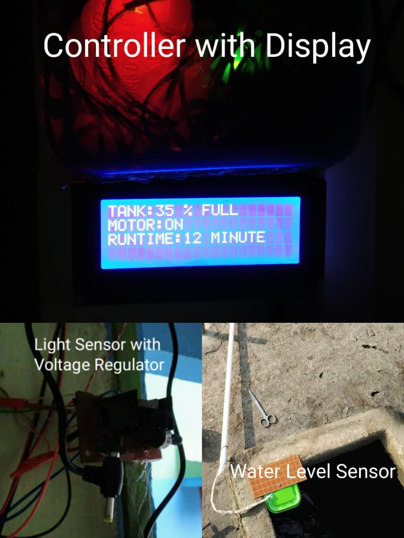

# Automatic-Water-Pump-and-Night-Light Combined
Used waterproof sonar sensor to measure the water level by the digital pin of ATmega328P Microcontroller and a self-made light sensor (light depending resistor and potentiometer) to measure the light intensity of light by analog pin; used optoisolated relay switch to automatically turn on/off the 1.5 HP water pump by the microcontroller depending on the water level; used a relay switch along with BC 547 transistor to atomically turn on/off the night light by the microcontroller depending on the outdoor light intensity. 
Tools: C/C++ 

